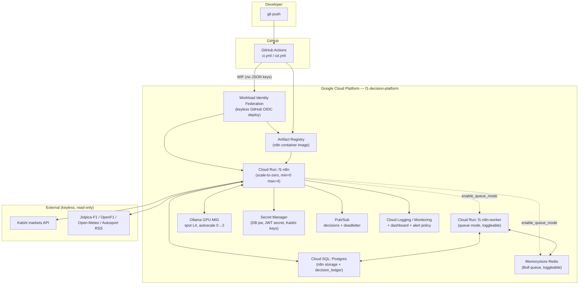
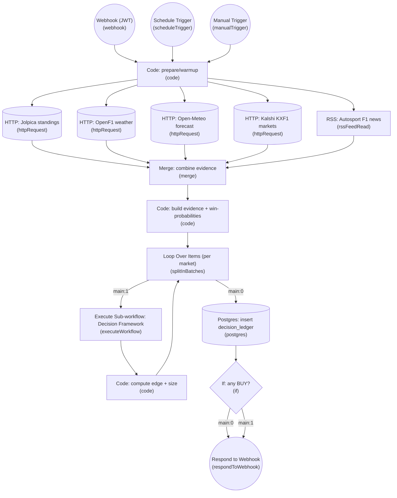
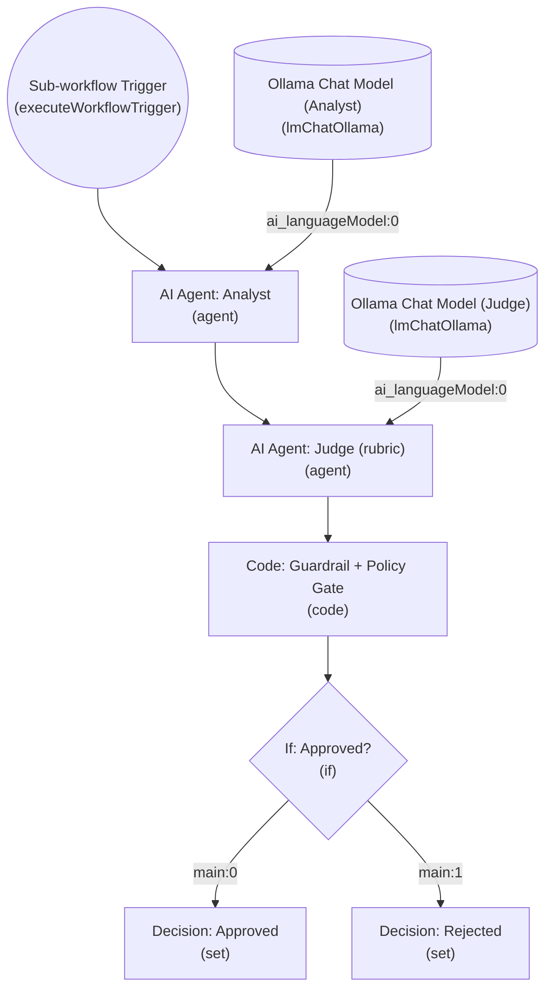

<p align="center">
  
  
  
  
  
  
</p>

# f1-decision-platform

**A reusable, domain-agnostic decision framework — `ingest → enrich → AI agent → LLM-as-judge → guardrail/policy gate → decision record → action` — orchestrated entirely in [n8n](https://n8n.io), instantiated as a flagship F1 / Kalshi prediction-market betting-edge engine.**

The flagship instance ingests live F1 championship data, weather, and news, computes each driver's win probability with a transparent softmax model, compares it against [Kalshi](https://kalshi.com) prediction-market prices to find a betting **edge**, hands the evidence to a **local LLM agent** (Qwen, via Ollama — no external AI API, ever) for a reasoned probability assessment, submits that assessment to an **adversarial LLM-as-judge** scored against a rubric, applies a **governance/policy gate**, and writes an auditable, paper-trade-only decision to a Postgres ledger exposed over the n8n public API. Everything — triggers, HTTP calls, the AI agent, the judge, the database write — runs as nodes in an inspectable n8n workflow graph, not hidden application code.

The framework itself (`packages/core` + `workflows/00-decision-framework.json`) has no F1-specific logic. Swap the evidence sources and the domain prompt and it becomes a decision engine for anything else that fits the same shape: evidence in, calibrated probability out, adversarially reviewed, policy-gated, and logged.

## What it does — the money-shot example

Below is the **actual, unedited** output of `node packages/app/dist/cli.js --mode fixture --stub --limit 9`, run against the real captured fixtures in this repo (deterministic `StubLLM`, no GPU needed):

```
SUBJECT                                                MODEL  MARKET  EDGE    ACTION  JUDGE  STATUS
-----------------------------------------------------  -----  ------  ------  ------  -----  --------
Will Valtteri Bottas win the F1 Drivers Championship?  0.000  0.020   -0.020  PASS    pass   approved
Will Sergio Perez win the F1 Drivers Championship?     0.000  0.020   -0.020  PASS    pass   approved
Will Pierre Gasly win the F1 Drivers Championship?     0.012  0.020   -0.008  PASS    pass   approved
Will Oscar Piastri win the F1 Drivers Championship?    0.183  0.235   -0.052  PASS    pass   approved
Will Oliver Bearman win the F1 Drivers Championship?   0.014  0.020   -0.006  PASS    pass   approved
Will Nico Hulkenberg win the F1 Drivers Championship?  0.000  0.020   -0.020  PASS    pass   approved
Will Max Verstappen win the F1 Drivers Championship?   0.121  0.315   -0.194  PASS    pass   approved
Will Lance Stroll win the F1 Drivers Championship?     0.013  0.020   -0.007  PASS    pass   approved
Will Lando Norris win the F1 Drivers Championship?     0.200  0.135   0.065   BUY     pass   approved

(9 decision(s) — dry-run, not persisted; pass --db-url to persist)
```

Read the Norris row: the softmax model (`packages/f1model/src/model.ts`) estimates his win probability at **0.200**, but Kalshi's `yes_bid`/`yes_ask` on `KXF1-...-NORRIS` imply the market only prices him at **0.135**. `edge = modelProb − marketProb = +0.065`, which clears the policy's `minEdge` (0.05) and `minConfidence` (0.55) thresholds (`packages/f1model/src/edge.ts:decideAction`), so the system recommends **BUY**. The LLM-judge independently scores the reasoning behind it as `pass`, the guardrail/policy gate approves it, and it is written to `decision_ledger` as `status: approved`. Every other market's edge is negative or below threshold, so they correctly `PASS`. This is a real, reproducible run against real (if demo-priced — see [Data sources](#data-sources-all-free--keyless)) market data, not a mocked example.

## Architecture



Deployed live to GCP project `f1-decision-platform` (`infra/terraform/`). n8n runs on Cloud Run today; the Ollama GPU MIG is written and `terraform apply`-ready but deferred pending an L4 quota grant on the project (see [Honest limitations](#honest-limitations) and `BLOCKERS.md`).

## The n8n workflow graph

These are generated straight from the real workflow JSON in `workflows/` by `scripts/export-graph.mjs` (`node scripts/export-graph.mjs workflows/10-f1-edge-flagship.json docs/img/10-f1-edge-flagship.mmd`) — GitHub renders the fences below natively, no external tooling needed. Sticky-note documentation nodes are excluded from the graph (they carry no execution edges); see `workflows/README.md` for the annotated walkthrough and `make graph` / workflow import for a live n8n canvas view.

### `10-f1-edge-flagship.json` — the flagship pipeline (17 executable nodes, 3 trigger types)



### `00-decision-framework.json` — the reusable, domain-agnostic decision core (9 executable nodes)

Called once per market via **Execute Sub-workflow** from the flagship graph above. It has no F1/Kalshi-specific logic at all — this is the part that's reusable for any other decision domain.



A third workflow, `workflows/90-warmup-ping.json` (6 nodes), polls Ollama and pre-warms the model before a real run so the first Agent/Judge call doesn't eat a multi-minute cold-load penalty — see `workflows/README.md`.

## Quickstart

Runs **clone → up with zero credentials**, against real captured fixture data (see [Data sources](#data-sources-all-free--keyless)):

```bash
git clone <this-repo> && cd f1-decision-platform
cp .env.example .env        # optional — sane defaults are baked in
docker compose up -d        # postgres + n8n + ollama
make warm                   # pull qwen2.5:7b-instruct / qwen2.5:14b-instruct into ollama
make import-workflows       # import workflows/*.json into the running n8n
make e2e                    # run the end-to-end decision pipeline script
```

Or skip Docker/n8n entirely and run the TypeScript pipeline directly:

```bash
npm install && npm run build
node packages/app/dist/cli.js --mode fixture --stub --limit 9   # deterministic, no GPU
node packages/app/dist/cli.js --mode fixture --model qwen2.5:14b-instruct  # real local LLM
```

`make help` lists every lifecycle target (`up`/`down`/`logs`/`seed`/`graph`/`pdf`/`bootstrap-gcp`/`deploy`/`gpu-up`/`gpu-down`/...).

## The decision pipeline, explained

The framework (`packages/core`) implements seven stages, mirrored 1:1 by `workflows/00-decision-framework.json` + `workflows/10-f1-edge-flagship.json`:

| # | Stage | Flagship implementation | Framework implementation |
|---|---|---|---|
| 1 | **Ingest** | 5 parallel HTTP/RSS calls (Jolpica, OpenF1, Open-Meteo, Kalshi, Autosport) with retry, merged into one evidence bundle — `packages/app/src/evidence.ts:gatherEvidence` | `Evidence[]` contract, `packages/contracts/src/schemas.ts` (Zod-validated on the way in) |
| 2 | **Enrich** | Softmax win-probability model + betting-edge calculation — `packages/f1model/src/model.ts`, `packages/f1model/src/edge.ts` | domain-supplied `context` on `DecisionInput` |
| 3 | **AI agent** | Local Qwen produces a structured `{probability, reasoning, keyFactors}` from evidence only — `packages/core/src/agent.ts:assess` | n8n **AI Agent: Analyst** node + **Ollama Chat Model** |
| 4 | **LLM-as-judge** | An independent local Qwen call scores the assessment 0–1 against a weighted rubric — `packages/core/src/judge.ts:judge`, rubric in `packages/contracts/src/rubric.ts` | n8n **AI Agent: Judge (rubric)** node + its own **Ollama Chat Model** |
| 5 | **Guardrail / policy gate** | Pre-assessment fast-fail (`checkInputPolicy`) + post-assessment policy check (`checkDecisionPolicy`) — `packages/core/src/guardrail.ts` | n8n **Code: Guardrail + Policy Gate** node |
| 6 | **Decision record** | Zod-validated, immutable record assembled and schema-checked — `packages/core/src/decision.ts:buildDecisionRecord` + `DecisionRecordSchema` | n8n **If: Approved?** → **Decision: Approved/Rejected** |
| 7 | **Action** | BUY/PASS/HOLD + half-Kelly position size, written to the `decision_ledger` Postgres table and returned via the webhook response — `packages/app/src/persist.ts`, `db/schema.sql`, n8n **Postgres: insert decision_ledger** → **Respond to Webhook** | (domain-specific — the framework returns the decision, the caller decides what "action" means) |

`packages/core/src/decision.ts:runDecision` is the orchestrator: input-policy check → agent assess → edge → judge → (revise loop, up to `maxRevise`) → decision-policy check → record. The whole thing is deterministic and unit-testable via `StubLLM` (`packages/core/src/ollama.ts`) with zero network/GPU dependency — that's how 141 tests run in under a second (see below).

## Testing & Quality Harness

This is the most heavily invested-in part of the repo — TDD throughout, with tests at every seam so the AI-in-the-loop pieces stay honest.

### Local: 141 tests, 17 files, ~99% coverage on every hand-written package

```
Test Files  17 passed (17)
     Tests  141 passed (141)
  Duration  872ms
```

| Package | Stmts | Branch | Funcs | Notes |
|---|---|---|---|---|
| `@f1/contracts` | 100% | 98.6% | 100% | Every external payload (Jolpica, Kalshi, OpenF1, Open-Meteo, RSS) validated by a Zod schema, plus the judge rubric and policy loader. |
| `@f1/kalshi` | 100% | 93.6% | 95.8% | Includes an RSA-PSS **signature round-trip test** (`signer.test.ts`) verifying `signKalshiRequest` against Node's own `crypto.verify`. |
| `@f1/f1model` | 100% | 99.0% | 100% | Softmax model + edge/Kelly-sizing math — pure functions, exhaustively tested. |
| `@f1/core` | 99.6% | 94.9% | 96.8% | The reusable framework: agent, judge, guardrail, decision assembly, `StubLLM`. Deterministic pipeline tests need **no GPU, no network**. |
| `@f1/app` | 74.2%* | 87.9% | 92% | End-to-end pipeline + evidence gathering are fully covered; `cli.ts` (a thin argv-parsing entrypoint) and `persist.ts`'s Postgres-backed `PgDecisionStore` (exercised at runtime against a real DB, not mocked in unit tests) pull the package average down. |

\* The monorepo-wide aggregate across all 5 packages is **93.56% statements / 94.52% branches / 95.83% functions** (v8 coverage, `npm run test:cov`) — every runtime library package clears **100% statements**; only the CLI entrypoint and the live-DB persistence adapter (intentionally not unit-mocked — see `packages/app/src/persist.ts`'s own doc comment) bring the package-level average for `@f1/app` down. All of this clears CI's enforced floor of **80% lines/functions/statements, 75% branches** (`vitest.config.ts`) with real margin.

Run it yourself:

```bash
npm run test:cov     # vitest run --coverage — fails the process if under threshold
make test-cov        # same, via the Makefile
```

### CI: 6 layered gates on every PR (`.github/workflows/ci.yml`)

| Gate | What it checks | Blocking |
|---|---|---|
| `build-test` | `tsc -b` → `eslint` → `vitest run --coverage` (80/80/75/80 threshold, enforced by `vitest.config.ts`) | Yes |
| `validate-artifacts` | Every `fixtures/**/*.json` parses; every `workflows/*.json` is a structurally valid n8n export (`nodes[].type`, `connections`) — `scripts/ci/validate-artifacts.mjs` | Yes |
| `terraform` | `terraform fmt -check` / `init -backend=false` / `validate` on `infra/terraform/` | Yes |
| `security` | `gitleaks` secret scan (blocking) + `npm audit --audit-level=high` (advisory) | Secret scan only |
| **`adversarial-review`** | See below | Yes, on high-severity findings |

**The adversarial reviewer is the headline gate.** It installs Ollama *inside the GitHub Actions runner*, pulls `qwen2.5:3b`, computes the PR's diff, and sends it to a system prompt (`scripts/ci/ai-review.mjs`) explicitly instructed to be adversarial: *"assume the author missed something and actively try to prove the diff is unsafe, incorrect, undertested, or overcomplicated."* It scores against a fixed rubric (correctness, security, test coverage, error handling, simplicity), parses the model's JSON findings, posts them as a PR comment / step summary, and **blocks the merge on any `high`-severity finding** — unless the PR carries the `override-ai-review` label (with an explanation left in a PR comment). No external AI API is used anywhere in this pipeline — the whole review runs on a 3B model inside the free GitHub Actions runner. Infra flakiness (Ollama fails to start, model pull fails, output doesn't parse) degrades gracefully to a non-blocking "skipped" notice rather than failing CI on infrastructure, not code.

## Real local-model evidence: the judge enforcing a quality bar

The stub-LLM table above proves the *pipeline* is correct. To prove the *AI* is doing real work, here's what happened running the same pipeline against a real local model (`qwen2.5:7b-instruct`, RTX 5080 + Ollama) instead of the deterministic stub: the 7B model's assessments were, in places, weakly grounded — and the adversarial LLM-judge **correctly rejected them**. One judge output included:

```json
{
  "criteria": { "evidence_grounded": 0, "reasoning_quality": 0 },
  "critique": "provides no reasoning ... arbitrarily assigns 100% confidence"
}
```

That decision was correctly marked governance-`rejected` rather than silently passed through. This is presented honestly, not swept under the rug: it's the **guardrail + LLM-judge doing exactly their job** — a small 7B model isn't always well-calibrated, and the system is designed to catch that rather than trust it blindly. Assessment quality scales with model size (`OLLAMA_MODEL_AGENT=qwen2.5:14b-instruct` is the default in `.env.example`; 32B or a hosted model behind the same OpenAI-compatible `LLM` interface — `packages/core/src/ollama.ts` — would improve it further), but the judge/guardrail layer is what makes the platform safe to point at a *weaker* model in the first place, since bad reasoning is caught rather than laundered into a trade decision.

## Attribute → implementation matrix

| # | Attribute | Implementation (real paths) |
|---|---|---|
| 2.1 | **Scalable** | Cloud Run `min_instance_count=0` scale-to-zero (`infra/terraform/cloudrun_n8n.tf`); Ollama GPU MIG autoscale 0→2 (`infra/terraform/ollama_gpu.tf`); toggleable queue-mode Redis + `n8n worker` service for horizontal scaling (`infra/terraform/queue_mode.tf`, `enable_queue_mode`) |
| 2.2 | **Secure OAuth/JWT + webhooks** | n8n JWT-authenticated `Webhook (JWT)` trigger in the flagship workflow (`workflows/10-f1-edge-flagship.json`); secrets in Secret Manager (`infra/terraform/secrets.tf`); keyless CI/CD via Workload Identity Federation (`infra/terraform/wif.tf`); RSA-PSS-signed Kalshi requests (`packages/kalshi/src/signer.ts`) |
| 2.3 | **Resilient** | `options.retry` (3 retries) on every ingest `HTTP Request` node in the flagship workflow; n8n's own execution error handling; Postgres persistence of every run/evidence/decision (`db/schema.sql`); Cloud Run + MIG auto-heal via health/liveness probes; Pub/Sub dead-letter topic + subscription (`infra/terraform/pubsub.tf`) |
| 2.4 | **AI-enabled** | n8n `AI Agent` + `lmChatOllama` nodes calling local Qwen (`workflows/00-decision-framework.json`); TypeScript mirror in `packages/core/src/agent.ts` + `judge.ts`; no external AI API dependency anywhere |
| 2.5 | **Multi-function decision framework** | `packages/core` (agent/judge/guardrail/decision, domain-agnostic) + `workflows/00-decision-framework.json` (the reusable sub-workflow, zero F1-specific logic) |
| 2.6 | **API-first / REST** | n8n's own REST/public API surface; the flagship workflow's `Respond to Webhook` node returns the decision JSON to any caller |
| 2.7 | **Event-driven** | 3 trigger types on the flagship workflow (`Webhook`, `Schedule Trigger`, `Manual Trigger`); `90-warmup-ping.json` on a 15-minute schedule; Pub/Sub `decisions` topic (`infra/terraform/pubsub.tf`) |
| 2.8 | **Connects systems** | Kalshi, Jolpica-F1, OpenF1, Open-Meteo, Autosport RSS, Ollama, Postgres, Pub/Sub — 8 distinct systems wired together in one workflow graph |
| 2.9.1 | **Dev standard** | TDD with an enforced 80%-lines/80%-functions/75%-branches/80%-statements coverage gate (`vitest.config.ts`, `.github/workflows/ci.yml`); Ollama-Qwen adversarial CI code reviewer (`scripts/ci/ai-review.mjs`) |
| 2.9.2 / 2.9.6 | **Deploy / env strategy** | Terraform → GCP (`infra/terraform/`), GitHub Actions CD gated behind `ENABLE_CD` repo variable + WIF (`.github/workflows/cd.yml`); `.env.example` documents every runtime var; `enable_gpu`/`enable_queue_mode`/`n8n_public` toggles for cost/topology tradeoffs (`infra/terraform/variables.tf`) |
| 2.9.3 / 2.9.8 | **Monitoring / observability** | Cloud Monitoring dashboard (`infra/terraform/dashboards/n8n-overview.json`, wired via `infra/terraform/monitoring.tf`), a log-based metric on `decision_logged` events, and a 5xx-error-rate alert policy |
| 2.9.4 | **Reliability** | Cloud SQL Postgres (`infra/terraform/cloudsql.tf`) as the durable store for both n8n's own state and the decision ledger; `decision_runs`/`evidence_snapshots`/`decision_ledger` tables persist full provenance for replay (`db/schema.sql`) |
| 2.9.5 | **Governance** | Guardrail + policy gate (`packages/core/src/guardrail.ts`), auditable decision ledger with `policy_violations`/`rationale`/`raw` columns (`db/schema.sql`), least-privilege IAM (`infra/terraform/iam.tf`, `wif.tf`), all secrets in Secret Manager (never in code or workflow JSON) |
| 2.9.7 | **Reusable frameworks / templates / prompts** | `workflows/00-decision-framework.json` (the callable sub-workflow) + the agent/judge prompt-building functions in `packages/core/src/agent.ts:buildPrompt` and `packages/core/src/judge.ts:buildPrompt`, parameterized entirely by evidence/rubric, not F1-specific strings |
| 2.9.9 | **Cloud** | Cloud Run (containers) + Docker (`docker-compose.yml` locally, upstream `n8nio/n8n` image in prod) + Ollama on a GCP GPU MIG (`infra/terraform/ollama_gpu.tf`) |

## Deploy to GCP

```bash
export PROJECT_ID=f1-decision-platform REGION=us-central1
make bootstrap-gcp   # one-time: create project, link billing, enable APIs, create tfstate bucket
make deploy          # terraform init + apply (infra/terraform/)
```

- **Scale-to-zero by default**: `min_instances=0` on the n8n Cloud Run service (`infra/terraform/variables.tf`) — idle cost is near-zero.
- **GPU is a toggle, not a hard dependency**: `enable_gpu` (default `true`) provisions the spot L4 Ollama MIG; set it to `false` for a CPU-only/no-GPU-quota demo. As deployed today, **the GPU MIG has not been created yet** — new GCP projects start with 0 GPU quota in most regions, and a quota increase request is pending (`BLOCKERS.md`, `scripts/deploy.sh`'s own printed note). n8n itself is live on Cloud Run.
- **CD is opt-in**: `.github/workflows/cd.yml` deploys on push to `main` via Workload Identity Federation (no long-lived GCP keys), but only runs when the `ENABLE_CD` repo variable is `true` — a deliberate safety gate documented in `.github/workflows/README.md`.

## Project layout

```
packages/
  contracts/   @f1/contracts  — shared types, Zod ingestion schemas, judge rubric, policy loader
  kalshi/      @f1/kalshi     — read-only Kalshi client, RSA-PSS signer, fixture-backed market fetcher
  f1model/     @f1/f1model    — softmax win-probability model, edge calc, half-Kelly sizing
  core/        @f1/core       — the reusable decision framework: agent, judge, guardrail, decision record, Ollama client
  app/         @f1/app        — end-to-end pipeline + the `f1-decision` CLI
fixtures/      real captured snapshots of every external data source (see below)
workflows/     importable n8n workflow JSON exports (the visual centerpiece)
db/            decision_runs / evidence_snapshots / decision_ledger schema
infra/terraform/  GCP IaC — Cloud Run, Cloud SQL, Ollama GPU MIG, Pub/Sub, Secret Manager, WIF, monitoring
scripts/       bootstrap-gcp.sh, deploy.sh, export-graph.mjs, ci/ai-review.mjs, ci/validate-artifacts.mjs
docs/img/      generated Mermaid (.mmd) exports of every workflow graph
```

## Data sources (all free / keyless)

| Source | What it provides | Auth |
|---|---|---|
| [Jolpica-F1](https://api.jolpi.ca) | Championship standings, race results (Ergast-compatible) | None |
| [OpenF1](https://openf1.org) | Session metadata, trackside weather telemetry | None |
| [Open-Meteo](https://open-meteo.com) | Race-weekend weather forecast | None |
| [Autosport](https://www.autosport.com) | F1 news RSS feed | None |
| [Kalshi](https://kalshi.com) | Prediction-market prices (`GET /trade-api/v2/markets`) | None to *read* — RSA-PSS signing (`packages/kalshi/src/signer.ts`) is only needed to *place* orders, which this system never does; it is paper-trade-only by design |

`fixtures/` holds real, captured snapshots of every one of the above (see `fixtures/README.md` + `fixtures/manifest.json`), so `docker compose up` runs **clone → run with zero credentials**. Note: Kalshi's real F1-2026 markets were captured with a genuinely empty off-season order book (`yes_bid`/`yes_ask` null); those 22 markets were synthetically demo-priced (flagged `_demo_priced: true`, real thin values preserved alongside) so the edge math has something to compute against — see `fixtures/README.md`'s "Kalshi demo pricing" section for full transparency on exactly which numbers are synthetic.

## Design decisions

- **Local-Qwen-only, always.** `packages/core/src/ollama.ts:OllamaClient` talks to any OpenAI-compatible `/v1/chat/completions` endpoint — Ollama today, a hosted model tomorrow if ever wanted — but the shipped configuration (`.env.example`, `docker-compose.yml`, the n8n workflow's `lmChatOllama` nodes) never calls out to an external AI API. This was a deliberate constraint, not a limitation: it keeps the whole pipeline auditable, cost-free to run, and reproducible offline.
- **Fixture-default Kalshi.** `KALSHI_MODE=fixture` is the default everywhere (`.env.example`, `packages/app/src/evidence.ts`). Live mode (`KALSHI_MODE=live`) fetches real market data with zero credentials (Kalshi's market-read endpoints are public); only order *placement* would need signing keys, and this system never places orders.
- **Paper-only, on purpose.** There is no order-submission code path anywhere in `@f1/kalshi` (see the file-level comment in `packages/kalshi/src/client.ts`: *"Paper-only: order execution intentionally not implemented; this client is read-only"*). Every "BUY" is a logged, auditable recommendation in `decision_ledger`, never a real trade.
- **Deterministic-by-construction library code.** Only `packages/app/src/cli.ts` is allowed to touch `Date.now()`/`randomUUID()` — every other module takes `createdAt`/`id` as parameters, which is what makes the 141-test suite fast and hermetic (see the doc comment at the top of `cli.ts`).

## Honest limitations

- **7B local model quality**: as shown above, `qwen2.5:7b-instruct` sometimes produces weakly-grounded assessments that the LLM-judge correctly rejects. This is presented as evidence the guardrail works, not swept under the rug — but it does mean the *default* agent model is `qwen2.5:14b-instruct` (`.env.example`, `packages/app/src/cli.ts:DEFAULT_MODEL`) for better calibration, and even that has not been benchmarked at the same rigor as the deterministic stub path.
- **GPU not yet live on GCP**: `infra/terraform/ollama_gpu.tf` is written, `enable_gpu`-toggled, and `terraform apply`-ready, but the spot L4 MIG has not actually been created in the deployed project pending an L4 GPU quota grant (`BLOCKERS.md`). n8n itself is deployed and reachable on Cloud Run today.
- **Live Kalshi null-price handling**: `packages/kalshi/src/client.ts:normalizeMarket` preserves `null` `yes_bid`/`yes_ask` rather than coercing to `0` specifically so a genuinely empty order book produces a `HOLD` (`packages/f1model/src/edge.ts:computeEdge`) rather than a false high-edge signal — this is exercised by the fixture data (see the Kalshi demo-pricing note above) but has not yet been observed against a live, currently-open F1 betting market.
- **Grafana dashboard and live n8n canvas screenshot**: the Cloud Monitoring dashboard JSON is written and deployed (`infra/terraform/dashboards/n8n-overview.json`), but a rendered screenshot of it (and of the live n8n editor canvas, importable via `make import-workflows`) is not yet captured in this repo.
