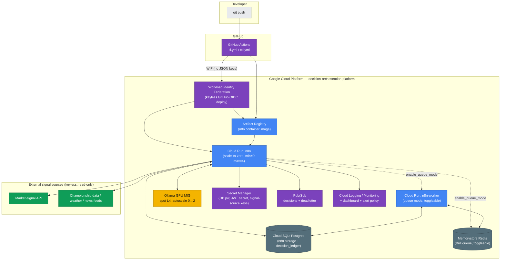

<p align="center">
  
  
  
  
  
  
  
</p>

# Decision Orchestration Platform

**A source-agnostic, `n8n`-orchestrated platform for scalable, secure, resilient, AI-enabled decision automation.**

This repository is a reference build of an enterprise decisioning platform — the kind of standard an automation/platform team would adopt so that every business function stops reinventing "gather evidence, get an AI opinion, have it checked, apply policy, log it, act" from scratch. The core is [n8n](https://n8n.io) as the orchestration engine: every trigger, HTTP call, AI agent invocation, judge call, and database write is a node in an inspectable, versioned n8n workflow graph — not logic buried in application code that only engineers can read. Around that core sit the platform standards enterprises actually need before they'll trust automation with real decisions: API-first and event-driven integration (REST, webhooks, OAuth/JWT), a layered CI/CD gate (build, lint, test-with-coverage, artifact validation, Terraform validation, secret scanning, and an adversarial AI code reviewer), infrastructure-as-code on GCP with a scale-to-zero cost model, observability (structured logging, a Cloud Monitoring dashboard, alert policies), and governance (an auditable decision ledger, least-privilege IAM, policy guardrails that gate every AI-produced recommendation before it can take effect).

The AI layer is deliberately **local-first but API-first**: a local LLM agent (Qwen, via [Ollama](https://ollama.com)) does the reasoning and judging by default, which keeps the platform cheap to run and keeps sensitive evidence off third-party infrastructure. But the agent talks to any OpenAI-compatible `/v1/chat/completions` endpoint (`packages/core/src/ollama.ts:OllamaClient`), so swapping in a hosted frontier model for a higher-stakes decision domain is one credential and one config value away — not a rewrite. That's the responsible-AI story in practice: run the cheap, private model by default, escalate to a stronger one deliberately, and keep the same guardrail/judge/policy layer around either.

The **evidence sources and the F1/prediction-market domain in this build are a reference implementation, not the point.** The reusable core — `packages/core` plus `workflows/00-decision-framework.json` — has zero F1-specific logic: it takes an `Evidence[]` bundle and a subject, produces an AI assessment, has an independent AI judge score that assessment against a rubric, applies a policy gate, and returns a governed decision record. Point the same core at a different set of evidence adapters and a different domain prompt and it decides for a different business problem entirely — for example: **credit/risk underwriting** (financial evidence in, approve/decline/refer recommendation out), **insurance claims triage** (claim documents + policy data in, fast-track/investigate recommendation out), **supplier selection** (RFP responses + compliance data in, award/reject recommendation out), **content moderation** (submitted content + policy rules in, allow/escalate/remove recommendation out), or **operations routing** (incident/ticket evidence in, team/priority assignment out). Swapping domains means swapping the ingest nodes and the prompt — the orchestration graph, the judge, the guardrail, and the governance ledger stay exactly the same.

## Attribute → implementation matrix

| # | Attribute | Implementation (real paths) |
|---|---|---|
| 2.1 | **Scalable** | Cloud Run `min_instance_count=0` scale-to-zero (`infra/terraform/cloudrun_n8n.tf`); Ollama GPU MIG autoscale 0→2 (`infra/terraform/ollama_gpu.tf`); toggleable queue-mode Redis + `n8n worker` service for horizontal scaling (`infra/terraform/queue_mode.tf`, `enable_queue_mode`) |
| 2.2 | **Secure integration — OAuth/JWT + webhooks** | n8n JWT-authenticated `Webhook (JWT)` trigger in the flagship workflow (`workflows/10-f1-edge-flagship.json`); secrets in Secret Manager (`infra/terraform/secrets.tf`); keyless CI/CD via Workload Identity Federation (`infra/terraform/wif.tf`); RSA-PSS-signed requests to the external market-signal API (`packages/kalshi/src/signer.ts`) |
| 2.3 | **Resilient** | `options.retry` (3 retries) on every ingest `HTTP Request` node in the flagship workflow; n8n's own execution error handling; Postgres persistence of every run/evidence/decision (`db/schema.sql`); Cloud Run + MIG auto-heal via health/liveness probes; Pub/Sub dead-letter topic + subscription (`infra/terraform/pubsub.tf`) |
| 2.4 | **AI-enabled** | n8n `AI Agent` + `lmChatOllama` nodes calling a local LLM (`workflows/00-decision-framework.json`); TypeScript mirror in `packages/core/src/agent.ts` + `judge.ts`; local by default, one config value from a hosted frontier model via the same OpenAI-compatible interface |
| 2.5 | **Multi-function decisioning framework** | `packages/core` (agent/judge/guardrail/decision, domain-agnostic) + `workflows/00-decision-framework.json` (the reusable sub-workflow, zero domain-specific logic) — see [Introduction](#decision-orchestration-platform) for example domains beyond the F1 reference build |
| 2.6 | **API-first / REST** | n8n's own REST/public API surface; the flagship workflow's `Respond to Webhook` node returns the decision as JSON to any caller |
| 2.7 | **Event-driven** | 3 trigger types on the flagship workflow (`Webhook`, `Schedule Trigger`, `Manual Trigger`); `90-warmup-ping.json` on a 15-minute schedule; Pub/Sub `decisions` topic (`infra/terraform/pubsub.tf`) |
| 2.8 | **Connects enterprise systems, automation platforms, and AI services** | External market-signal API, championship-data API, weather APIs, news RSS, Ollama, Postgres, Pub/Sub — 8 distinct systems wired together in one workflow graph, each behind a typed adapter (see [Data sources](#data-sources)) |
| 2.9.1 | **Development standard** | TDD with an enforced 80%-lines/80%-functions/75%-branches/80%-statements coverage gate (`vitest.config.ts`, `.github/workflows/ci.yml`); Ollama-Qwen adversarial CI code reviewer (`scripts/ci/ai-review.mjs`); workflow JSON validated against n8n's own node schemas by importing into a live n8n instance, and compatible with the **n8n-mcp** toolchain (programmatic node discovery / workflow-JSON validation) and **n8n-skills** for AI-assisted authoring |
| 2.9.2 / 2.9.6 | **Deployment / environment strategy** | Terraform → GCP (`infra/terraform/`), GitHub Actions CD gated behind `ENABLE_CD` repo variable + WIF (`.github/workflows/cd.yml`); `.env.example` documents every runtime var; `enable_gpu`/`enable_queue_mode`/`n8n_public` toggles for cost/topology tradeoffs (`infra/terraform/variables.tf`) |
| 2.9.3 / 2.9.8 | **Monitoring / observability** | Cloud Monitoring dashboard (`infra/terraform/dashboards/n8n-overview.json`, wired via `infra/terraform/monitoring.tf`), a log-based metric on `decision_logged` events, and a 5xx-error-rate alert policy |
| 2.9.4 | **Reliability** | Cloud SQL Postgres (`infra/terraform/cloudsql.tf`) as the durable store for both n8n's own state and the decision ledger; `decision_runs`/`evidence_snapshots`/`decision_ledger` tables persist full provenance for replay (`db/schema.sql`) |
| 2.9.5 | **Governance** | Guardrail + policy gate (`packages/core/src/guardrail.ts`), auditable decision ledger with `policy_violations`/`rationale`/`raw` columns (`db/schema.sql`), least-privilege IAM (`infra/terraform/iam.tf`, `wif.tf`), all secrets in Secret Manager (never in code or workflow JSON) |
| 2.9.7 | **Reusable frameworks / templates / prompt patterns** | `workflows/00-decision-framework.json` (the callable sub-workflow) + the agent/judge prompt-building functions in `packages/core/src/agent.ts:buildPrompt` and `packages/core/src/judge.ts:buildPrompt`, parameterized entirely by evidence/rubric — no domain-specific strings |
| 2.9.9 | **Cloud (GCP)** | Cloud Run (containers) + Docker (`docker-compose.yml` locally, upstream `n8nio/n8n` image in prod) + Ollama on a GCP GPU MIG (`infra/terraform/ollama_gpu.tf`) |

## The n8n workflow graph

The workflow graph *is* the platform's logic surface — triggers, HTTP calls, the AI agent, the judge, and the database write all run as nodes on a canvas that a non-engineer can open, read, and reason about. The screenshots below are the real, importable workflows in `workflows/` (`make import-workflows` loads them into a running n8n instance).


> **`00-decision-framework` — the domain-agnostic decision core**, highlighted because it's the reusable part of this platform. 9 executable nodes: agent → judge → guardrail/policy gate → decision. It has no F1-specific logic at all — swap the evidence sources and the domain prompt feeding it, and it decides for any domain (see the example domains in the [Introduction](#decision-orchestration-platform)).


Mermaid source for both graphs lives in `docs/img/*.mmd`, generated straight from the workflow JSON by `scripts/export-graph.mjs`; `make graph` regenerates them. A third workflow, `workflows/90-warmup-ping.json` (6 nodes), polls Ollama and pre-warms the model on a schedule so the first Agent/Judge call of a session doesn't eat a multi-minute cold-load penalty — see `workflows/README.md` for the full annotated walkthrough of every node.

## The decision pipeline, explained

Every decision — regardless of domain — moves through the same seven stages, implemented once in `packages/core` and mirrored 1:1 as n8n nodes in `workflows/00-decision-framework.json` + `workflows/10-f1-edge-flagship.json`. The business point of this structure: **the policy thresholds, the judge's rubric, the guardrail rules, and the workflow graph itself are all data and configuration, not compiled application code.** An analyst or risk owner can open the n8n canvas, change a threshold in `.env`, or edit the rubric weights in `packages/contracts/src/rubric.ts` without a developer touching a compiler — the logic that governs a decision is owned by the business, not hidden inside a binary.

| # | Stage | Business purpose | Flagship implementation | Framework implementation |
|---|---|---|---|---|
| 1 | **Ingest** | Pull every piece of relevant evidence from its system of record before forming an opinion | 5 parallel HTTP/RSS calls (championship data, weather x2, market-signal API, news) with retry, merged into one evidence bundle — `packages/app/src/evidence.ts:gatherEvidence` | `Evidence[]` contract, `packages/contracts/src/schemas.ts` (Zod-validated on the way in) |
| 2 | **Enrich** | Turn raw evidence into a comparable, quantitative estimate | Softmax win-probability model + model-vs-market signal calculation — `packages/f1model/src/model.ts`, `packages/f1model/src/edge.ts` | domain-supplied `context` on `DecisionInput` |
| 3 | **AI agent** | Produce a structured, reasoned assessment instead of an opaque score | Local Qwen produces a structured `{probability, reasoning, keyFactors}` from evidence only — `packages/core/src/agent.ts:assess` | n8n **AI Agent: Analyst** node + **Ollama Chat Model** |
| 4 | **LLM-as-judge (responsible-AI gate)** | Independently check the AI's reasoning quality before it can influence a real decision | A second, independent local Qwen call scores the assessment 0–1 against a human-authored, weighted rubric — `packages/core/src/judge.ts:judge`, rubric in `packages/contracts/src/rubric.ts` | n8n **AI Agent: Judge (rubric)** node + its own **Ollama Chat Model** |
| 5 | **Guardrail / policy gate** | Enforce business policy deterministically, independent of what the AI concluded | Pre-assessment fast-fail (`checkInputPolicy`) + post-assessment policy check (`checkDecisionPolicy`) — `packages/core/src/guardrail.ts` | n8n **Code: Guardrail + Policy Gate** node |
| 6 | **Decision record** | Produce an immutable, schema-checked artifact that can be replayed or audited later | Zod-validated, immutable record assembled and schema-checked — `packages/core/src/decision.ts:buildDecisionRecord` + `DecisionRecordSchema` | n8n **If: Approved?** → **Decision: Approved/Rejected** |
| 7 | **Action** | Turn a governed decision into a recommendation a downstream system or human can act on | Recommend act / hold / decline (`BUY`/`HOLD`/`PASS` in code) + half-Kelly sizing where applicable, written to the `decision_ledger` Postgres table and returned via the webhook response — `packages/app/src/persist.ts`, `db/schema.sql`, n8n **Postgres: insert decision_ledger** → **Respond to Webhook** | (domain-specific — the framework returns the governed decision, the caller decides what "action" means downstream) |

`packages/core/src/decision.ts:runDecision` is the orchestrator: input-policy check → agent assess → signal computation → judge → (revise loop, up to `maxRevise`) → decision-policy check → record. The **adversarial LLM-as-judge** is worth calling out specifically: it doesn't just rubber-stamp the agent's output — it's instructed to score the agent's reasoning critically against the rubric, and a low score sends the assessment back for revision or has it rejected outright before it ever reaches the guardrail or the ledger. That's what makes it safe to run a smaller, cheaper local model as the primary agent: a bad or ungrounded assessment is caught and stopped, not silently passed through as a governed recommendation. The whole pipeline is deterministic and unit-testable via `StubLLM` (`packages/core/src/ollama.ts`) with zero network/GPU dependency — that's how 141 tests run in under a second (see [Testing & Quality Harness](#testing--quality-harness)).

### A real decision run

Below is real, reproducible output from `node packages/app/dist/cli.js --mode fixture --stub --limit 9`, run against captured fixture data in this repo (deterministic `StubLLM`, no GPU needed). This is an excerpt — three of the nine candidates evaluated in that run — chosen because it shows both outcomes side by side (run it yourself for the full nine-row output):

```
SUBJECT                                                MODEL  MARKET  SIGNAL  ACTION  JUDGE  STATUS
Will Oscar Piastri win the F1 Drivers Championship?    0.183  0.235   -0.052  PASS    pass   approved
Will Max Verstappen win the F1 Drivers Championship?   0.121  0.315   -0.194  PASS    pass   approved
Will Lando Norris win the F1 Drivers Championship?     0.200  0.135   +0.065  BUY     pass   approved
```

Read this as a business decision example: for each candidate, the system's model estimates a probability (`MODEL`) and compares it against an external market-implied probability (`MARKET`) — the gap between the two is the decision **signal**. For Norris, the softmax model (`packages/f1model/src/model.ts`) estimates a **0.200** win probability, but the external market-signal source implies only **0.135** — a **+0.065 signal** that clears the policy's `minEdge` (0.05) and `minConfidence` (0.55) thresholds (`packages/f1model/src/edge.ts:decideAction`), so the governed recommendation is **act** (`BUY` in the raw output — see [Terminology note](#a-note-on-the-action-codes) below). Piastri's and Verstappen's signals are negative — the market already prices them higher than the model does — so the system correctly recommends **decline** (`PASS`). In every row, an independent adversarial judge scored the reasoning `pass`, the policy gate approved it, and the outcome was written to the auditable `decision_ledger` as `status: approved`.

#### A note on the action codes

The pipeline's code and raw CLI output use the short codes `BUY` / `HOLD` / `PASS` for historical reasons tied to the reference domain — read them as decision recommendations, not trading instructions: `BUY` means **recommend act**, `HOLD` means **hold — insufficient signal or confidence to act**, and `PASS` means **decline — signal does not clear policy**. The `decision_ledger` table these are written to is an auditable decision record for governance and traceability, not a trade log — there is no order-execution code path anywhere in this repository (`packages/kalshi/src/client.ts` is read-only by design; see [Design decisions](#design-decisions)).

## Architecture



Deployed live to a GCP project (`infra/terraform/`) provisioned for this platform. n8n runs on Cloud Run today; the Ollama GPU MIG is written and `terraform apply`-ready but deferred pending an L4 quota grant on the project (see `BLOCKERS.md`).

## Testing & Quality Harness

This is the most heavily invested-in part of the repo — TDD throughout, with tests at every seam so the AI-in-the-loop pieces stay honest.

### Local: 141 tests, 17 files

```
Test Files  17 passed (17)
     Tests  141 passed (141)
  Duration  872ms
```

| Package | Stmts | Branch | Funcs | Notes |
|---|---|---|---|---|
| `@dop/contracts` | 100% | 98.6% | 100% | Every external payload (championship data, market signal, weather, news) validated by a Zod schema, plus the judge rubric and policy loader. |
| `@dop/kalshi` | 100% | 93.6% | 95.8% | Read-only external market-signal client. Includes an RSA-PSS **signature round-trip test** (`signer.test.ts`) verifying `signKalshiRequest` against Node's own `crypto.verify`. |
| `@dop/f1model` | 100% | 99.0% | 100% | Softmax model + signal/sizing math — pure functions, exhaustively tested. |
| `@dop/core` | 99.6% | 94.9% | 96.8% | The reusable decisioning framework: agent, judge, guardrail, decision assembly, `StubLLM`. Deterministic pipeline tests need **no GPU, no network**. |
| `@dop/app` | 74.2%* | 87.9% | 92% | End-to-end pipeline + evidence gathering are fully covered; `cli.ts` (a thin argv-parsing entrypoint) and `persist.ts`'s Postgres-backed `PgDecisionStore` (exercised at runtime against a real DB, not mocked in unit tests) pull the package average down. |

\* The monorepo-wide aggregate across all 5 packages is **93.56% statements / 94.52% branches / 95.83% functions** (v8 coverage, `npm run test:cov`) — every runtime library package clears **100% statements**; only the CLI entrypoint and the live-DB persistence adapter (intentionally not unit-mocked — see `packages/app/src/persist.ts`'s own doc comment) bring the package-level average for `@dop/app` down. All of this clears CI's enforced floor of **80% lines/functions/statements, 75% branches** (`vitest.config.ts`) with real margin.

Run it yourself:

```bash
npm run test:cov     # vitest run --coverage — fails the process if under threshold
make test-cov        # same, via the Makefile
```

### CI: 6 layered gates on every PR (`.github/workflows/ci.yml`)

| Gate | What it checks | Blocking |
|---|---|---|
| `build-test` | `tsc -b` → `eslint` → `vitest run --coverage` (80/80/75/80 threshold, enforced by `vitest.config.ts`) | Yes |
| `validate-artifacts` | Every `fixtures/**/*.json` parses; every `workflows/*.json` is a structurally valid n8n export (`nodes[].type`, `connections`) — `scripts/ci/validate-artifacts.mjs` | Yes |
| `terraform` | `terraform fmt -check` / `init -backend=false` / `validate` on `infra/terraform/` | Yes |
| `security` | `gitleaks` secret scan (blocking) + `npm audit --audit-level=high` (advisory) | Secret scan only |
| **`adversarial-review`** | See below | Yes, on high-severity findings |

**The adversarial reviewer is the headline governance gate.** It installs Ollama *inside the GitHub Actions runner*, pulls `qwen2.5:3b`, computes the PR's diff, and sends it to a system prompt (`scripts/ci/ai-review.mjs`) explicitly instructed to be adversarial: *"assume the author missed something and actively try to prove the diff is unsafe, incorrect, undertested, or overcomplicated."* It scores against a fixed rubric (correctness, security, test coverage, error handling, simplicity), parses the model's JSON findings, posts them as a PR comment / step summary, and **blocks the merge on any `high`-severity finding** — unless the PR carries the `override-ai-review` label (with an explanation left in a PR comment). This same responsible-AI pattern — a governed, rubric-scored AI check with a human override path — is the pattern the decision pipeline itself uses for the LLM-as-judge stage. No hosted AI API is required anywhere in this pipeline — the whole review runs on a 3B model inside the free GitHub Actions runner. Infra flakiness (Ollama fails to start, model pull fails, output doesn't parse) degrades gracefully to a non-blocking "skipped" notice rather than failing CI on infrastructure, not code.

The workflows are version-controlled JSON, validated against n8n's own node schemas by importing into a live n8n instance in CI. That schema-first surface is what makes the platform work hand-in-glove with **n8n-mcp** (programmatic node discovery and workflow-JSON validation against a live instance) and **n8n-skills** (repeatable, AI-assisted workflow-authoring patterns) for ongoing development.

## Quickstart

Runs **clone → up with zero credentials**, against real captured fixture data (see [Data sources](#data-sources)):

```bash
git clone <this-repo> && cd n8n
cp .env.example .env        # optional — sane defaults are baked in
docker compose up -d        # postgres + n8n + ollama
make warm                   # pull qwen2.5:7b-instruct / qwen2.5:14b-instruct into ollama
make import-workflows       # import workflows/*.json into the running n8n
make e2e                    # run the end-to-end decision pipeline script
```

Or skip Docker/n8n entirely and run the TypeScript pipeline directly:

```bash
npm install && npm run build
node packages/app/dist/cli.js --mode fixture --stub --limit 9   # deterministic, no GPU
node packages/app/dist/cli.js --mode fixture --model qwen2.5:14b-instruct  # real local LLM
```

`make help` lists every lifecycle target (`up`/`down`/`logs`/`seed`/`graph`/`pdf`/`bootstrap-gcp`/`deploy`/`gpu-up`/`gpu-down`/...).

## Deploy to GCP

```bash
export PROJECT_ID=<your-project-id> REGION=us-central1
make bootstrap-gcp   # one-time: create project, link billing, enable APIs, create tfstate bucket
make deploy          # terraform init + apply (infra/terraform/)
```

- **Scale-to-zero by default**: `min_instances=0` on the n8n Cloud Run service (`infra/terraform/variables.tf`) — idle cost is near-zero.
- **GPU is a toggle, not a hard dependency**: `enable_gpu` (default `true`) provisions the spot L4 Ollama MIG; set it to `false` for a CPU-only/no-GPU-quota demo. As deployed today, **the GPU MIG has not been created yet** — new GCP projects start with 0 GPU quota in most regions, and a quota increase request is pending (`BLOCKERS.md`, `scripts/deploy.sh`'s own printed note). n8n itself is live on Cloud Run.
- **CD is opt-in**: `.github/workflows/cd.yml` deploys on push to `main` via Workload Identity Federation (no long-lived GCP keys), but only runs when the `ENABLE_CD` repo variable is `true` — a deliberate safety gate documented in `.github/workflows/README.md`.

## Project layout

```
packages/
  contracts/   @dop/contracts — shared types, Zod ingestion schemas, judge rubric, policy loader
  kalshi/      @dop/kalshi    — read-only external market-signal client, RSA-PSS signer, fixture-backed fetcher
  f1model/     @dop/f1model   — softmax probability model, model-vs-market signal calc, half-Kelly sizing
  core/        @dop/core      — the reusable decision framework: agent, judge, guardrail, decision record, Ollama client
  app/         @dop/app       — end-to-end pipeline + the `f1-decision` CLI
fixtures/      real captured snapshots of every external data source (see below)
workflows/     importable n8n workflow JSON exports (the visual centerpiece)
db/            decision_runs / evidence_snapshots / decision_ledger schema
infra/terraform/  GCP IaC — Cloud Run, Cloud SQL, Ollama GPU MIG, Pub/Sub, Secret Manager, WIF, monitoring
scripts/       bootstrap-gcp.sh, deploy.sh, export-graph.mjs, ci/ai-review.mjs, ci/validate-artifacts.mjs
docs/img/      generated Mermaid (.mmd) exports + PNG screenshots of every workflow graph
```

## Data sources

Every evidence source is a **pluggable adapter**, not a hardcoded integration: each one is an n8n `HTTP Request` or `RSS Read` node paired with a typed `@dop/*` client and a Zod schema that validates the payload on the way in (`packages/contracts/src/schemas.ts`). Swapping a data source for a different domain means pointing the node at a new endpoint and writing a new Zod schema for its response shape — nothing else in the pipeline changes. This is the source-agnostic story in practice: the platform doesn't know or care that today's evidence happens to be F1 championship data. Secure integration is handled the same way regardless of source — OAuth2/JWT credential types in n8n, secrets in GCP Secret Manager, and RSA-signed requests where the upstream API requires it (`packages/kalshi/src/signer.ts`).

| Source | Signal it provides | Swap-in note |
|---|---|---|
| [Jolpica-F1](https://api.jolpi.ca) | Championship standings, race results (Ergast-compatible) | Any REST API returning structured domain state — replace with a claims system, a CRM, or an ERP feed |
| [OpenF1](https://openf1.org) | Session metadata, trackside weather telemetry | Any real-time telemetry/event API |
| [Open-Meteo](https://open-meteo.com) | Race-weekend weather forecast | Any contextual/environmental data API |
| [Autosport](https://www.autosport.com) | F1 news RSS feed | Any RSS/news feed — swap for an industry news feed or an internal announcements feed |
| [Kalshi](https://kalshi.com) | External market-implied probability (the model-vs-market decision signal) | Any external benchmark/reference-rate API — a credit bureau score, an actuarial table, a market index |

`fixtures/` holds real, captured snapshots of every one of the above (see `fixtures/README.md` + `fixtures/manifest.json`), so `docker compose up` runs **clone → run with zero credentials**. Note: the market-signal source's real F1-2026 markets were captured with a genuinely empty off-season order book (`yes_bid`/`yes_ask` null); those 22 markets were synthetically demo-priced (flagged `_demo_priced: true`, real thin values preserved alongside) so the signal math has something to compute against — see `fixtures/README.md`'s "Kalshi demo pricing" section for full transparency on exactly which numbers are synthetic.

## Design decisions

- **Source-agnostic framework, pluggable reference domain.** `packages/core` and `workflows/00-decision-framework.json` contain zero domain-specific logic — the F1/prediction-market build in this repo is one instantiation, chosen because it has genuinely live, free, keyless APIs to demonstrate the full pipeline end to end. Swapping the evidence adapters and the domain prompt (`packages/core/src/agent.ts:buildPrompt`) retargets the same core to a different business decision.
- **Local-LLM-first, API-first by design.** `packages/core/src/ollama.ts:OllamaClient` talks to any OpenAI-compatible `/v1/chat/completions` endpoint. The shipped configuration (`.env.example`, `docker-compose.yml`, the n8n workflow's `lmChatOllama` nodes) runs entirely on a local Ollama model — auditable, cost-free to run, reproducible offline, and keeps evidence off third-party infrastructure. Pointing the same interface at a hosted frontier model for a higher-stakes decision domain is a config change, not an architecture change.
- **Humans own the logic.** The policy thresholds (`.env`, `packages/core/src/guardrail.ts`), the judge's rubric (`packages/contracts/src/rubric.ts`), and the entire workflow graph (`workflows/*.json`, viewable on the n8n canvas) are inspectable, versioned configuration — a policy owner or analyst can change what the platform will and won't approve without a developer touching compiled code.
- **Fixture-backed, zero-credential onboarding.** `KALSHI_MODE=fixture` and the equivalents for every other source default to on everywhere (`.env.example`, `packages/app/src/evidence.ts`), backed by real captured API snapshots in `fixtures/`. Anyone can clone and run the full pipeline with no API keys; flipping to live mode is a config change per source, and only order-*placement*-style write paths (which this platform doesn't implement — see below) would ever need signing credentials.
- **Read-only by construction on the reference domain.** There is no order-submission code path anywhere in `@dop/kalshi` (see the file-level comment in `packages/kalshi/src/client.ts`: *"Paper-only: order execution intentionally not implemented; this client is read-only"*). Every governed recommendation is a logged, auditable entry in `decision_ledger` — a decision record, not a transaction.
- **Deterministic-by-construction library code.** Only `packages/app/src/cli.ts` is allowed to touch `Date.now()`/`randomUUID()` — every other module takes `createdAt`/`id` as parameters, which is what makes the 141-test suite fast and hermetic (see the doc comment at the top of `cli.ts`).
- **Known gap, tracked openly.** The Ollama GPU MIG on GCP is written and `terraform apply`-ready but not yet provisioned pending an L4 quota grant (`BLOCKERS.md`) — n8n itself is live on Cloud Run today, and the local Ollama stack runs the full AI pipeline in the meantime.
